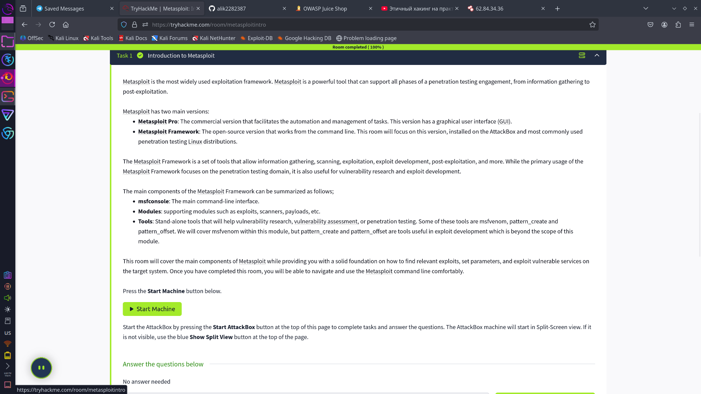
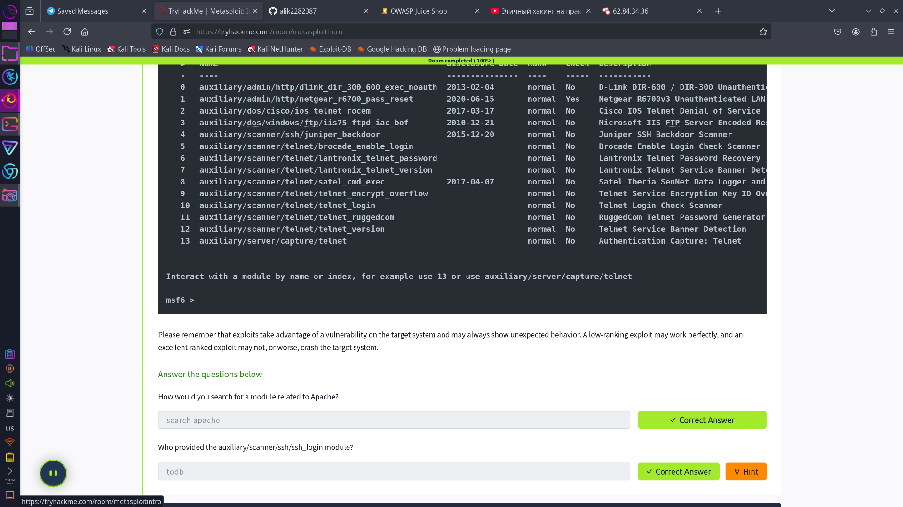
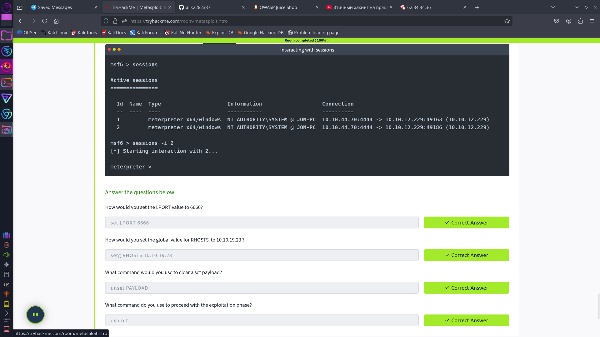
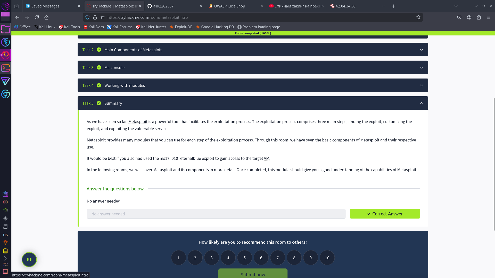

## metasploit
извините но мне лень писать ридми файл 

---

### важно знатть перед выполнением этой комнаты

---

## 🔧 Metasploit — это

Фреймворк для взлома: можно искать уязвимости, запускать эксплойты и получать доступ к системе.

Запуск:  
```bash
msfconsole
```

---

## 📂 Основные типы модулей

| Тип         | Для чего нужен               |
|-------------|------------------------------|
| `exploit`   | Использует уязвимость        |
| `payload`   | Код, который запускается     |
| `auxiliary` | Сканеры, брутфорс и т.д.     |
| `post`      | Действия после взлома        |

---

## 📌 Полезные команды

```bash
search smb             # Поиск модуля
use exploit/...        # Выбор модуля
show options           # Показать параметры
set RHOSTS 10.10.X.X   # IP цели
set LHOST 10.10.X.X    # IP атаки
exploit                # Запустить
sessions               # Показать сессии
sessions -i 1          # Подключиться к сессии
```

---

## 🧱 Типы payload'ов

| Тип       | Описание                        |
|-----------|----------------------------------|
| singles   | Всё в одном                     |
| staged    | Подгружает части по очереди     |
| stagers   | Загружает основной payload      |

---

## 🕸 Сети

- `RHOSTS` — IP цели (виртуалка от TryHackMe)
- `LHOST` — твой IP (Kali или AttackBox)
- `LPORT` — порт для соединения (например, 4444)
  
---

### я просто скину скриншоты сюда ну а вы смотрите 

---

## скрины

### Финал


### Вступление


### Первые вопросы

я тут немного не понял с последним вопросом так что с читирел 

### Поиск модулей

я тут тоже чуть не понял так что пришлось взять подсказку

### Настройка параметров


### Концовка

